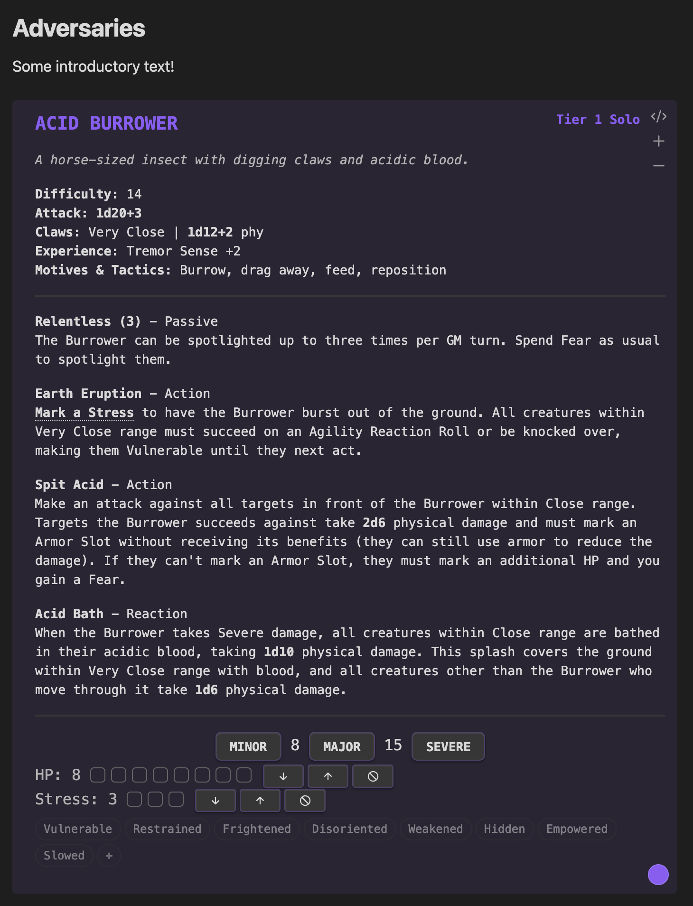
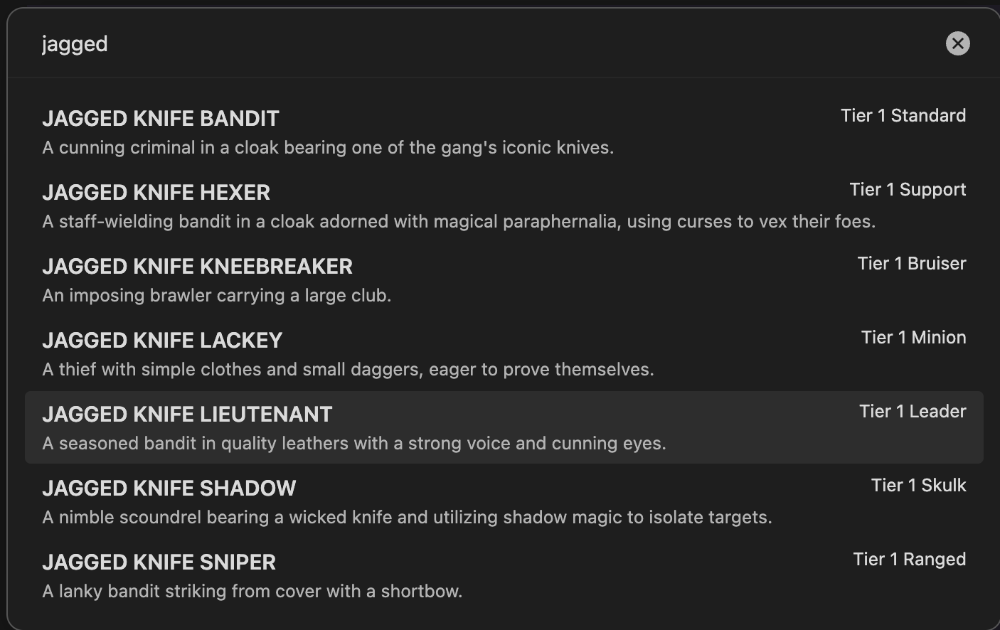
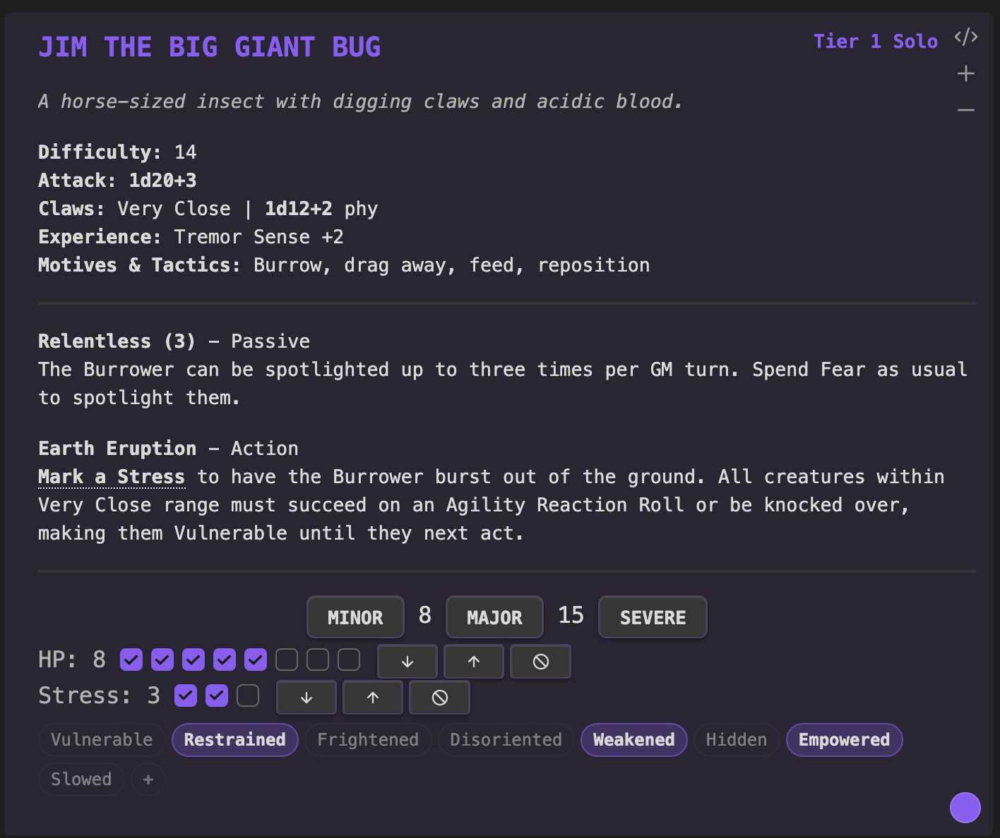
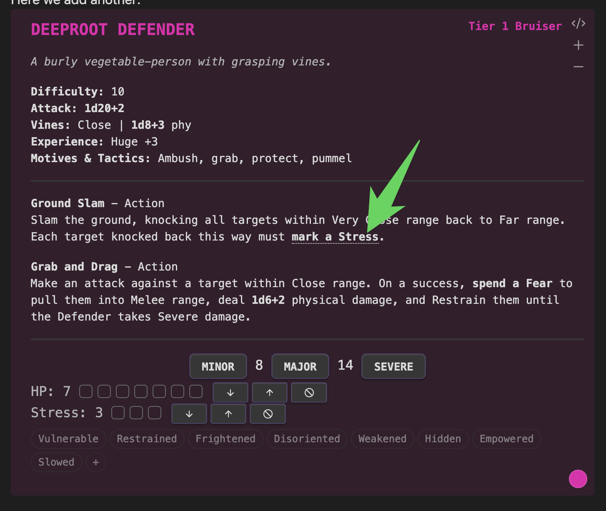

# Arrowed's Adversary Bank

An [Obsidian.md](https://obsidian.md) plugin that turns your campaign notes into a live Daggerheart encounter table. Search the SRD or your homebrew library, drop adversaries and environments straight into the page you're already writing in, then run the fight from the same note — HP, stress, conditions, and all.

[](https://ko-fi.com/arrowedisgaming)



## Features

### The whole SRD, ready to drop in



Every adversary and every environment from the Daggerheart SRD, one command away. Hit `Ctrl+P`, type a name, and the stat block lands in the note you're already in. Drop your own homebrew folder in and it shows up in the same picker — no separate workflow for your custom stuff. Works in Obsidian Canvas too, so you can lay out an encounter visually and run it from the canvas.

### Track everything live, per instance



HP, stress, conditions, feature uses, countdowns — all tracked right on the stat block. Mark a threshold with a click, clear it with Alt-click. Running two Bladed Guards or six skeletons from a single block? Each instance keeps its own state and its own name. Toggle the eight standard Daggerheart conditions on any instance, or define your own — "Burning," "Marked by the Hunter," whatever the table needs.

### Stat blocks that work like tools



Click an attack bonus to roll it. Click "Mark a Stress" inside a feature description and it actually marks one — and if there are several copies in play, a picker asks which one takes it. A feature that summons reinforcements gets a button that drops the named adversary into the note. The battle points counter in the status bar keeps a running total so you know exactly what the encounter costs. Less flipping between pages, more time running the scene.

## Installation

Open Obsidian, go to `Settings` > `Community plugins`, click `Browse`, and search for **Arrowed's Adversary Bank**. Or install it directly from the [Obsidian plugin directory](https://obsidian.md/plugins?id=arroweds-adversary-bank).

## Usage

### Insert from Library

Insert an adversary via a command: `Ctrl+P` > `Insert adversary from library`, or use the side ribbon menu (crossed-swords icon).

> [!TIP]
> Bind plugin commands to hotkeys from the Hotkeys settings tab.
> For example, `Alt+A` for adversaries and `Alt+E` for environments.

> [!TIP]
> `Click` threshold buttons to mark the corresponding amount of HP. Use `Alt+Click` to clear it instead.

### Renaming

- **Auto-suffix:** Inserting the same adversary twice auto-names them "Bladed Guard" and "Bladed Guard 2"
- **Inline rename:** Double-click the adversary name on a rendered card to edit it. Press Enter to save, Escape to cancel.
- **Instance names:** When you have 2+ copies (via the +/- buttons), each instance's stat bar shows a clickable name label. Click to customize it.

### Conditions

Below each instance's HP and Stress slots, you'll see condition badges for the 8 standard Daggerheart conditions. Click to toggle.

**Custom conditions** can be added two ways:
1. In the YAML: add a `conditions` field with a list of custom condition names
2. At runtime: click the `+` button on the condition bar, type a name, press Enter

```yaml
name: Chimera
hp: 9
stress: 5
conditions:
  - Poisoned
  - Burning
```

### Summon Buttons

Add a `summon` field to any feature to get a button that inserts the named adversary:

```yaml
features:
- name: Raise Dead
  type: Action
  desc: The Necromancer raises skeletal warriors.
  summon:
    - Skeleton Warrior
    - Skeleton Archer
```

### HP/Stress Controls

Each HP and Stress row has inline buttons:
- **-** removes one mark
- **+** adds one mark
- **x** clears all marks

## Reference

The `daggerheart` code block parses the adversary or environment as [YAML](https://yaml.org) with the following properties:

| Property | Definition | Example |
| --- | --- | --- |
| `name` | Name of the adversary | `Bear` |
| `tier` | Adversary tier | `1` |
| `type` | Type of the adversary | `Bruiser` |
| `desc` | Adversary description | `A large bear with thick fur and powerful claws.` |
| `difficulty` | Adversary difficulty | `14` |
| `weapon` | Name of the adversary's weapon | `Claws` |
| `range` | Range of the adversary's weapon | `Close` |
| `damage` | Amount and type of adversary's weapon damage | `1d8+3 phy` |
| `hp` | Total adversary hitpoint slots | `6` |
| `stress` | Total adversary stress slots | `3` |
| `thresholds` | Adversary thresholds, separated by a `/`; leave blank for minions with 1 HP | `9/17` |
| `attack` | Adversary attack bonus; click to roll for attack | `+1` |
| `xp` | Adversary experiences | `Ambusher +2, Keen Senses +3` |
| `motives` | Adversary's motives and tactics | `Climb, defend territory, pummel, track` |
| `conditions` | Custom condition names for this adversary | `Poisoned, Burning` |
| `features` | List of feature objects, see table below | |
| `id` | Stat block id for state tracking; auto-generated, can be any random string | `a2sd4vsf` |

`features` properties:

| Property | Definition | Example |
| --- | --- | --- |
| `name` | Name of the feature | `Relentless (2)` |
| `type` | Feature type | `Passive` |
| `desc` | Feature description; supports markdown | `Make a standard attack. On a success, the target is *Vulnerable* until they next act.` |
| `uses` | Uses per scene | `2` |
| `countdown` | Size of the countdown | `6` |
| `flavor` | Hints for GM/PCs | `Have any of the PCs forded rivers like this before?` |
| `summon` | Adversary name(s) to summon | `Skeleton Warrior` or a YAML list |

For environments, `weapon`, `damage`, `range`, `hp`, `stress`, `thresholds`, `attack`, `xp`, `motives` are not set.
Instead, additional properties are available:

| Property | Definition | Example |
| --- | --- | --- |
| `impulses` | Environment impulses | `Bar crossing, carry away the unready, divide the land` |
| `adversaries` | Potential adversaries in an environment | `Guards, Masked Thief, Merchant` |
| `tone` | Tone and feel of the environment | `Musty and mournful, serene yet slightly wrong` |

All properties are optional and simply won't render if skipped.

> [!IMPORTANT]
> Do not use `TAB` in stat blocks. The indents for features must be manually indented with spaces.

### Alt install method

<details>
<summary>Manual install</summary>

1. Go to the [latest release](https://github.com/arrowedisgaming/arroweds-adversary-bank/releases/latest)
2. Download `main.js`, `manifest.json` and `styles.css`
3. Inside your Obsidian vault, create folder `.obsidian/plugins/arroweds-adversary-bank`
4. Copy the downloaded files to this folder
5. If Obsidian was open, restart it
6. Navigate to `Settings` > `Community plugins` and enable Arrowed's Adversary Bank
</details>

<details>
<summary>Release provenance</summary>

Release assets are built by GitHub Actions and published with GitHub artifact attestations. To verify a downloaded asset, install the GitHub CLI and run:

```bash
gh attestation verify main.js -R arrowedisgaming/arroweds-adversary-bank
gh attestation verify styles.css -R arrowedisgaming/arroweds-adversary-bank
```
</details>


## Attributions

Arrowed's Adversary Bank began as a fork of [BeastVault](https://github.com/ly0va/beastvault) by [Lyova Potyomkin](https://github.com/ly0va), licensed under the [MIT License](LICENSE). The original BeastVault was inspired by [FreshCutGrass](https://freshcutgrass.app) and [DaggerForge](https://github.com/Torutu/daggerforge).

### Copyright Notice

This plugin includes materials from the Daggerheart System Reference Document 1.0, (c) Critical Role, LLC. All rights reserved.

Public Game Content created and owned by Darrington Press, LLC. Available at https://www.daggerheart.com.

Licensed under the Darrington Press Community Gaming License: https://darringtonpress.com/license/.

Stat blocks may have minor edits to correct obvious errors.
